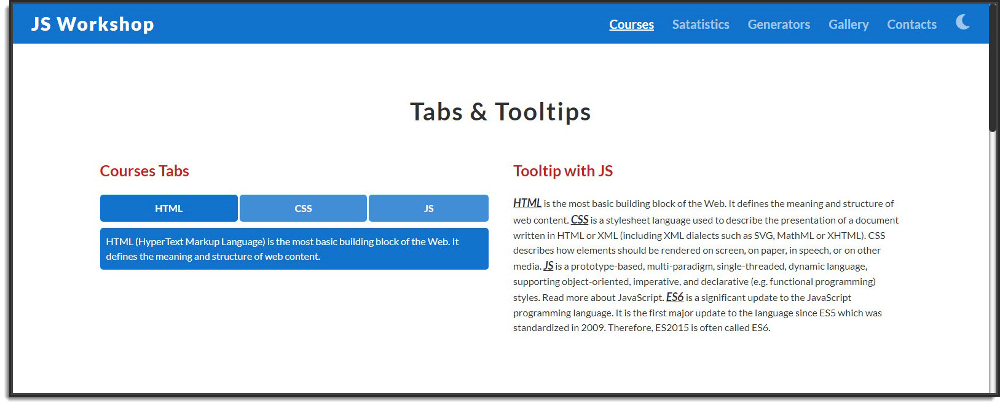
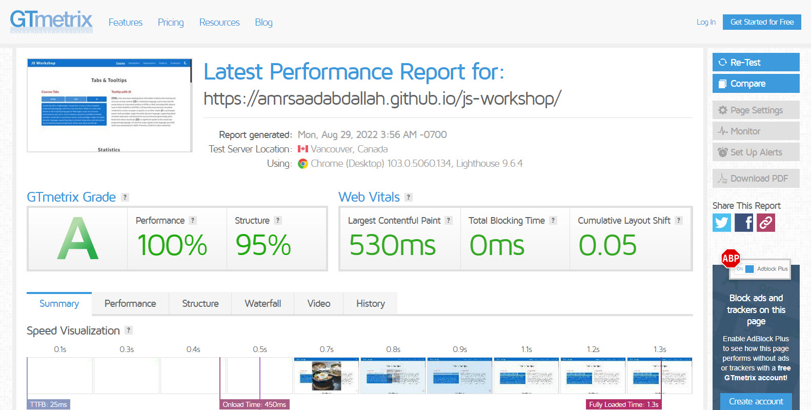

<h1 align="center">  JS Workshop </h1>

### 👁️ Project Preview:

- [ Live Preview 👉 https://amrsaadabdallah.github.io/js-workshop](https://amrsaadabdallah.github.io/js-workshop)

- [ Github Repo 👉 https://github.com/amrsaadabdallah/my-js-workshop](https://github.com/amrsaadabdallah/my-js-workshop)
  - 🚩 It's a private repo <a target="_blank" href="mailto:amrsaadabdallah@gmail.com">contact me </a>to see.

---

### 📝 Project Description & features:

- It's a landing page used to practice HTML5, CSS3, SASS, Vanilla JS.

---

### 🛠️ Project Tools:

1. SASS.

1. Fontawsome icons library.

1. Used Google Fonts.

1. ParcelJS a Bundler Tool.

1. [Squoosh](https://squoosh.app/) is an online tool for image compression web app that reduces image sizes through numerous formats.

1. [GTmetrix](https://gtmetrix.com/) is an online tool for customers to easily test the performance of their webpages.

---

### :sparkles: Project Skills applied:

1. Link Web Fonts (Lato, Roboto) from google fonts.

1. Practice CSS preprocessor (SASS) features like adding nested rules, variables, mixins, selector inheritance, and more.

1. Write Vanilla JavaScript to create a dynamic web app, EX:

   - Preloader functionality
   - Light & Dark Mode.
   - Navbar toggler buttom functionality
   - Sticky navbar
   - Handle smooth scrolling in internal navigation
   - Tabs Component
   - Tooltip Component
   - CountTo Component on scrolling to it once.
   - Random Quotes Generate
   - Random Code Generate
   - modal functionality
   - Internet status notification
   - Handle scroll to top button
   - Update Current year

1. Bundle project by using Parceljs.

1. Compression images using [Squoosh](https://squoosh.app/) tool.

1. Test the performance of the webpage after deploy by using [GTmetrix](https://gtmetrix.com/).

---

### 🧪 Project performance test:

Test the performance of the webpage after deploy by using [GTmetrix](https://gtmetrix.com/).

---

### 👋 Get In Touch:

- [🌐 Website 👉 https://amrsaadabdallah.github.io](https://amrsaadabdallah.github.io)
- [👔 LinkedIn 👉 https://www.linkedin.com/in/amrsaadabdallah](https://www.linkedin.com/in/amrsaadabdallah)
- [🌟 Github 👉 https://github.com/amrsaadabdallah](https://github.com/amrsaadabdallah)
- [📧 Gmail 👉 amrsaadabdallah@gmail.com](mailto:amrsaadabdallah@gmail.com)
- [🐤 Twitter 👉 https://twitter.com/amrsaadabdallah](https://twitter.com/amrsaadabdallah)
- [:phone: Whatsapp 👉 (+20) 109-775-6067](https://api.whatsapp.com/send/?phone=%2B2001097756067&text&type=phone_number&app_absent=0)

---

<a target="_blank" href="https://amrsaadabdallah.github.io">

 2022 &copy; Amr Saad Abdallah 

</a>

